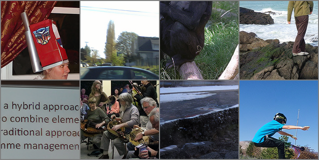

This repository contains the implementation of a reference-based image super-resolution method using Swin Transformer, conditioned on a high-resolution (HR) reference image.
> Masi Aslahishahri <br>


## Results


## Dependencies and Installation

1. Clone Repo

   ```bash
   git clone https://github.com/bia006/Ref-SR-with-ldm.git
   ```

2. Create Conda Environment
   ```bash
   conda env create -f environment.yaml
   conda activate ref-SR-ldm
   ```

3. Install Dependencies

   ```bash
   cd Ref-SR-with-ldm
   pip install -r requirements.txt
   ```

## Dataset Preparation

- Train Set: [CUFED Dataset](https://1drv.ms/u/c/bd573295b568b2d4/ETkSlA1kT0xCpdQOOIAfgk4B8SpxP1Cb0CahsrS6MlBzig?e=PEOTdl)
- Test Set: [WR-SR Dataset](https://drive.google.com/drive/folders/16UKRu-7jgCYcndOlGYBmo5Pp0_Mq71hP?usp=sharing), [CUFED5 Dataset](https://1drv.ms/u/c/bd573295b568b2d4/Ef4VxEI9Yr9Fr1KTOyWovXgBcp_rXYzNJykU9AuT0pHmMg?e=KjLcjs)

Please refer to [prepare-dataset.py](./prepare-dataset.py) for pre-processing and more details.

### Test
1. Pretrained Autoencoding Models are downloaded from [latent-diffusion](https://github.com/CompVis/latent-diffusion).

2. To test the model: 

    ```bash
    python scripts/ref-SR.py --indir testset-directory --outdir output-directory
    ```

3.  Check out the results in `./results`.


### Train
1. Pretrained Autoencoding Models are downloaded from [latent-diffusion](https://github.com/CompVis/latent-diffusion).

2. To train the network: 
   ```bash
   python main.py --base configs/latent-diffusion/ref-SR.yaml -t --gpus 0,
   ```
   
## License and Acknowledgement

This project is open sourced under MIT license. The code framework is mainly modified from [latent-diffusion](https://github.com/CompVis/latent-diffusion). Please refer to the original repo for more usage and documents.

